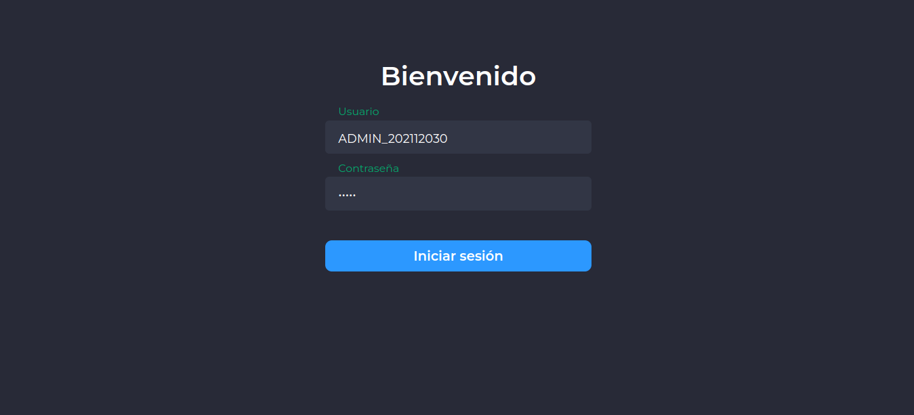
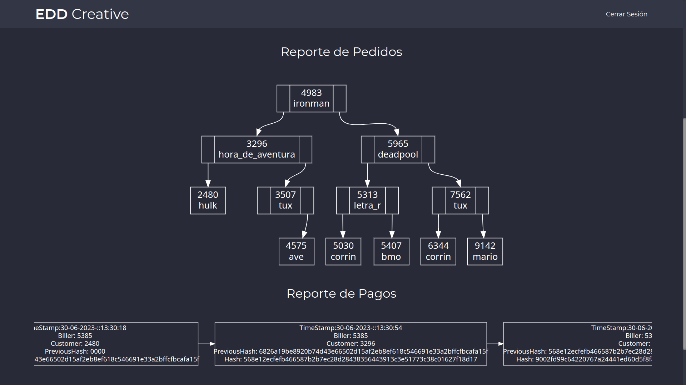
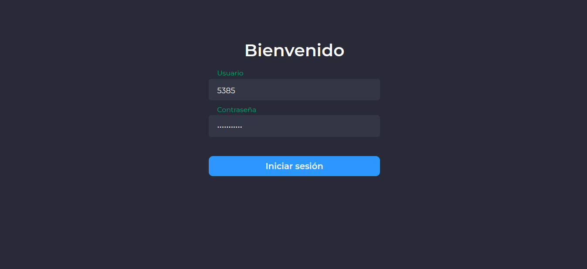
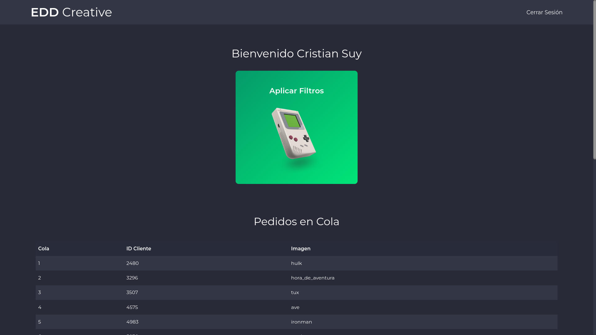
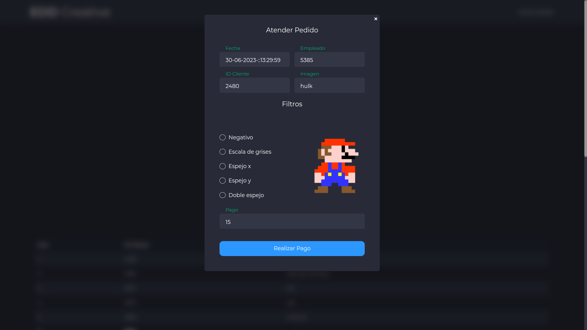
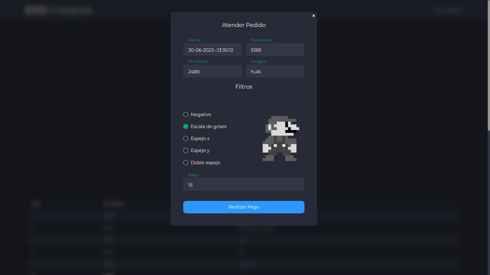
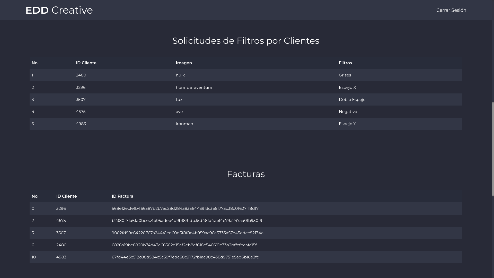
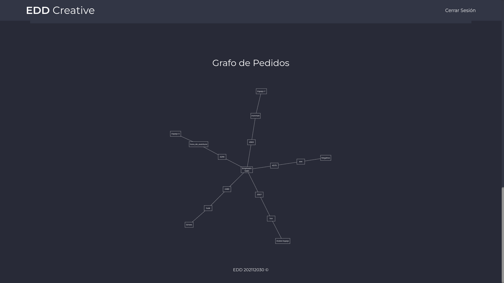

# **PROYECTO ESTRUCTURAS DE DATOS - FASE 2**

Brandon Andy Jefferson Tejaxún Pichiyá - 202112030

## 🎯 **Objetivos**

### **General**

Aplicar los conocimientos del curso de Estructuras de Datos en el desarrollo de diferentes estructuras de datos y los diferentes algoritmos de manipulación de información en ellas.

### **Específicos**
* Utilizar el lenguaje Go para implementar estructuras de datos no lineales.
* Utilizar la herramienta Graphviz para graficar las estructuras de datos.
* Definir e implementar algoritmos de ordenamiento, búsqueda e inserción en las diferentes estructuras a implementar.

## 📌 **Manual de Usuario**

### 1. **Administrador**

1. Inicio de Sesión

    Se debe ingresar las credenciales válidas para el administrador para poder acceder al panel correspondiente.

    

        
    

    Se muestran cada una de las funcionalidades con las que cuenta el administrador y los reportes a los que tiene acceso.

    

        
    

 

2. Cargar Pedidos

    Se debe dar clic sobre la opción correspondiente y seleccionar el archivo en formato **.json** 

 

3. Cargar Empleados

    Sedebe dar clic sobre la opción correspondiente y seleccionar el archivo

 

4. Reportes

    Al cargar el archivo de pedidos, automáticamente se mostrarán en una estructura de **Árbol AVL**, al igual que cada una de las ventas serán registradas y se mostrará el reporte de, incluyendo datos relevantes como la hora, empleado que atendió el pedido, cliente, entre otros.

    

        
    

### 2. **Empleado**

1. Inicio de Sesión

    Se debe ingresar las credenciales válidas para un empleado, para poder acceder al panel correspondiente.

    

        
    

    Se muestran cada una de las funcionalidades con las que cuenta el administrador y los reportes a los que tiene acceso.

    

        
    

 

2. Aplicar Filtros

    Esta funcionalidad permite al empleado generar la imagen que el cliente ha solicitado aplicando filtros según se requieral.

    Filtros:
    * Negativo
    * Escala de Grises
    * Espejo en X
    * Espejo en Y
    * Espejo Doble

    Al momentode antender un pedido, inicialmente se mostrará una previsualización simbólica de la imagen original y cada uno de los filtros según se vayan seleccionando.

    

        
        
    

 

3. Reportes

    Cada venta realizada será asociado al Empleado que atendió el pedido, y se mostrará una tabla con los datos de cada venta, al igual que se mostrarán los datos de facturación en una tabla.

    

        
    

    Así mismo cada venta realizada se mostrará en un grafo asociado a cada empleado.

    

        
    
