# **PROYECTO ESTRUCTURAS DE DATOS**

Brandon Andy Jefferson Tejaxún Pichiyá - 202112030

1. [Objetivos](#🎯-objetivos)
2. [Manual de Usuario](#📌-manual-de-usuario)
3. [Manual Técnico](#📌-manual-de-técnico)


## 🎯 **Objetivos**

### **General**

Aplicar los conocimientos del curso Estructuras de Datos en el desarrollo de las diferentes estructuras de datos y los diferentes algoritmos de manipulación de la información en ellas.

### **Específicos**
* Utilizar el lenguaje Go para implementar estructuras de datos lineales.
* Utilizar la herramienta Graphviz para graficar las estructuras de datos.
* Definir e implementar algoritmos de ordenamiento, búsqueda e inserción en las diferentes estructuras a implementar.

## 📌 **Manual de Usuario**

### 1. **Administrador**

1. Inicio de Sesión

   Se debe ingresar las credenciales correspondientes al administrador para poder acceder al panel correspondiente.

   <p align="center">
        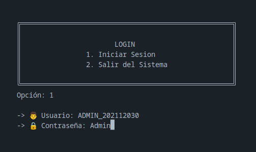
    </p>

   Se muestran cada una de las funcionalidades con las que cuenta el administrador, debe ingresar la opción a la que se desee acceder.

   <p align="center">
        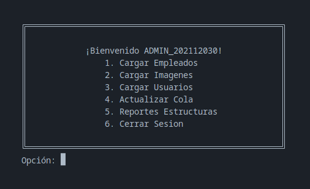
    </p>

   > Nota: Para cada una de las siguientes funcionalidades se deberá ingresar únicamente el nombre del archivo previamente guardado en la carpeta csv.
   >

<br>
2. Cargar Empleados
    <p align="center">
        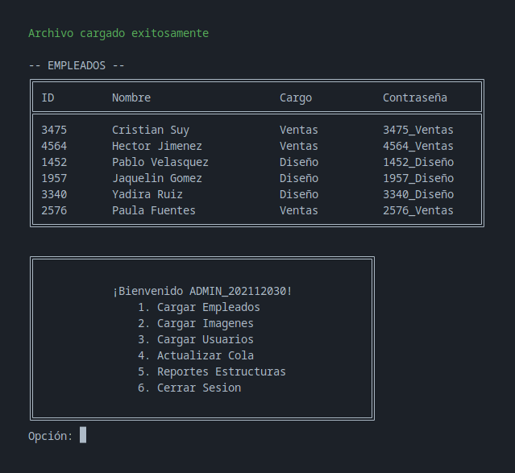
    </p>
3. Cargar Imágenes
    <p align="center">
        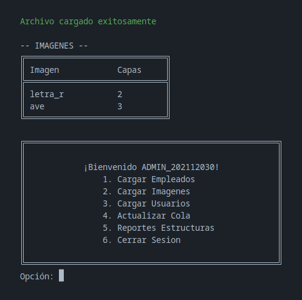
    </p>
4. Cargar Usuarios/Clientes
    <p align="center">
        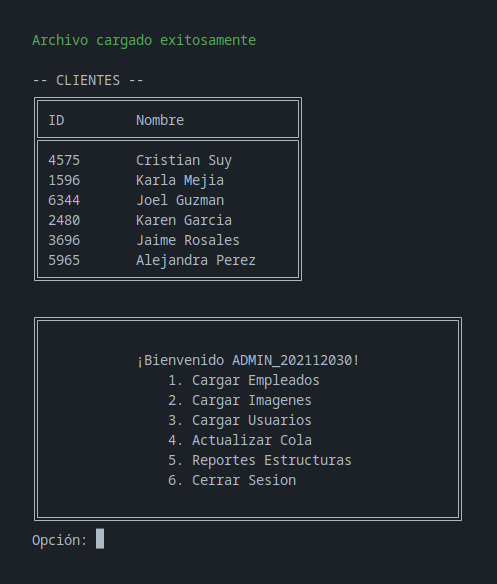
    </p>
5. Actualizar Cola
    <p align="center">
        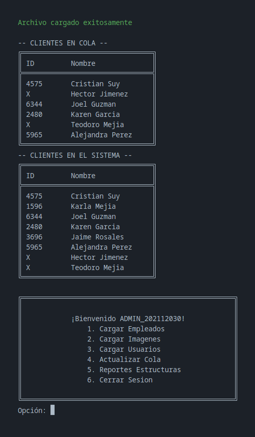
    </p>
6. Reportes

Esta sección cuenta con sub menú, en el que se detalla cada uno de los reportes al que es posible acceder, para ello debe ingresar la opción que desee visualizar.

<p align="center">
    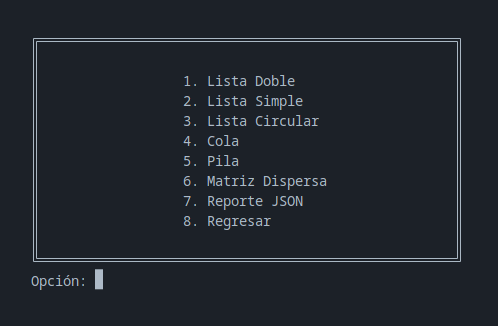
</p>

* [Lista Doble](./Reportes/ListaDoble.pdf)
* [Lista Simple](./Reportes/ListaSimple.pdf)
* [Lista Circular](./Reportes/ListaCircular.pdf)
* [Cola](./Reportes/Cola.pdf)
* [Pila](./Reportes/Pila.pdf)
* [Matriz Dispersa](./deadpool/cuerpo.pdf)
* [Reporte JSon](./Reportes/ReporteJSON.json)


### 2. **Empleado**

1. Inicio de Sesión

   El empleado debe ingresar sus credenciales para poder acceder al panel correspondiente.

   <p align="center">
        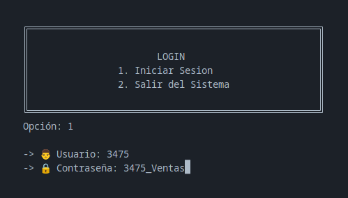
    </p>

   Se muestran cada una de las funcionalidades con las que cuenta el administrador, debe ingresar la opción a la que se desee acceder.

   <p align="center">
        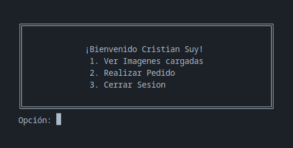
    </p>
2. Visualización de Imagenes

   Se muestran las imagenes existentes en el sistema y se solicita el ingreso del nombre de la imagen que se requiera previsualizar.

   <p align="center">
        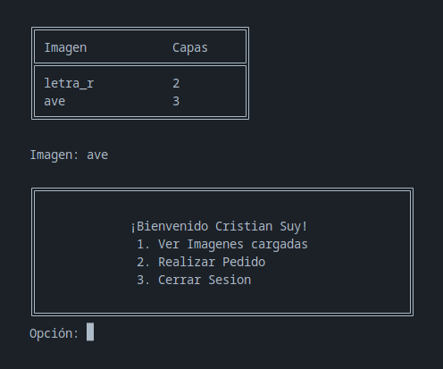
    </p>

   Seguidamente se crea una carpeta con el nombre de la imagen, el cual contiene el reporte de cada una de las capas de la imagen, el archivo HTML y CSS.

   <p align="center">
        
        
    </p>
3. Realizar Pedido

   Se muestra una tabla con los clientes en cola y se solicita el ID del cliente, seguidamente se muestra el ID del empleado a cargo del pedido. Se muestra el listado de imagenes disponibles y se solicita el nombre de la imagen que se desea y finalmente se mostrarán los datos en ese instintante en la cola de pedidos.

   > Nota: en caso de que el cliente sea nuevo en el sistema se le asignará un ID único para continuar con el proceso de pedidos.
   >

<br>
    <p align="center">
        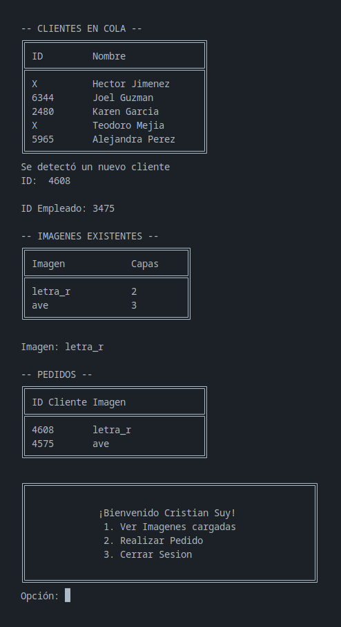
    </p>

## 📌 **Manual de Técnico**

### 1. **Estructuras**

1. Lista Doble Enlazada

   Se utilizó para el almacenamiento imagenes.

   ```go
   type ListaImg struct {
       primero  *Nodo
       ultimo   *Nodo
       longitud int
   }

   func (l *ListaImg) Insertar(imagen *Imagen) {
       if l.primero != nil {
           l.ultimo.siguiente = &Nodo{imagen: imagen}
           l.ultimo.siguiente.anterior = l.ultimo
           l.ultimo = l.ultimo.siguiente
           l.longitud++
           return
       }
       l.primero = &Nodo{imagen: imagen}
       l.ultimo = l.primero
       l.longitud++
   }
   ```
2. Lista Simple Enlazada

   Se utilizó para el almacenamiento de empleados.

   ```go
   type ListaEmp struct {
   primero  *Nodo
   ultimo   *Nodo
   longitud int
   }

   func (l *ListaEmp) Insertar(empleado *Empleado) {
       if l.primero != nil {
           l.ultimo.siguiente = &Nodo{empleado: empleado}
           l.ultimo = l.ultimo.siguiente
           l.longitud++
           return
       }
       l.primero = &Nodo{empleado: empleado}
       l.ultimo = l.primero
       l.longitud++
   }
   ```
3. Lista Circular Enlazada

   Se utilizó para el almacenamiento de clientes dentro del sistema.

   ```go
   type ListaCliente struct {
       primero  *Nodo
       ultimo   *Nodo
       longitud int
   }

   func (l *ListaCliente) Insertar(cliente *Cliente) {
       if l.Existe(cliente.Id) {
           return
       }
       if l.primero != nil {
           l.ultimo.siguiente = &Nodo{Cliente: cliente}
           l.ultimo = l.ultimo.siguiente
           l.ultimo.siguiente = l.primero
           l.longitud++
           return
       }
       l.primero = &Nodo{Cliente: cliente}
       l.ultimo = l.primero
       l.ultimo.siguiente = l.primero
       l.longitud++
   }
   ```
4. Cola

   Se utilizó para el almacenamiento de clientes en espera para tomar pedido.

   ```go
   type ColaCliente struct {
       Primero  *Nodo
       ultimo   *Nodo
       longitud int
   }

   func (c *ColaCliente) Insertar(cliente *Cliente) {
       if c.Primero != nil {
           c.ultimo.siguiente = &Nodo{Cliente: cliente}
           c.ultimo = c.ultimo.siguiente
           c.longitud++
           return
       }
       c.Primero = &Nodo{Cliente: cliente}
       c.ultimo = c.Primero
       c.longitud++
   }
   ```
5. Pila

   Se utilizó para tener un bitácora de cliente y pedido de imagen.

   ```go
   type Pila struct {
       ultimo *Nodo
   }

   func (p *Pila) Insertar(pedido *Pedido) {
       if p.ultimo != nil {
           nuevoNodo := &Nodo{pedido: pedido}
           nuevoNodo.anterior = p.ultimo
           p.ultimo = nuevoNodo
           return
       }
       p.ultimo = &Nodo{pedido: pedido}
   }
   ```
6. Matriz Dispersa

   Se utilizó para el almacenamiento de las capas que conforman cada imagen

   ```go
   type NodoCabeza struct {
       indice    int
       anterior  *NodoCabeza
       siguiente *NodoCabeza
       acceso    *NodoInterno
       ultimo    *NodoInterno
   }

   type NodoInterno struct {
       color     *Color
       fila      int
       columna   int
       derecha   *NodoInterno
       izquierda *NodoInterno
       arriba    *NodoInterno
       abajo     *NodoInterno
   }

   type ListaCabeza struct {
       primero *NodoCabeza
       ultimo  *NodoCabeza
   }

   func (nodo *ListaCabeza) insertar(indice int) {
       if nodo.primero != nil {
           if indice < nodo.primero.indice {
               nodo.primero.anterior = &NodoCabeza{indice: indice}
               nodo.primero.anterior.siguiente = nodo.primero
               nodo.primero = nodo.primero.anterior
           } else if indice > nodo.ultimo.indice {
               nodo.ultimo.siguiente = &NodoCabeza{indice: indice}
               nodo.ultimo.siguiente.anterior = nodo.ultimo
               nodo.ultimo = nodo.ultimo.siguiente
           } else {
               actual := nodo.primero
               for actual.siguiente != nil {
                   if indice > actual.indice && indice < actual.siguiente.indice {
                       tmp := &NodoCabeza{indice: indice}
                       tmp.anterior = actual
                       tmp.siguiente = actual.siguiente

                       actual.siguiente.anterior = tmp
                       actual.siguiente = tmp
                       return
                   }
                   actual = actual.siguiente
               }
           }
           return
       }
       nodo.primero = &NodoCabeza{indice: indice}
       nodo.ultimo = nodo.primero
   }

   func (nodo *ListaCabeza) existeNodo(indice int) bool {
       if nodo.primero != nil {
           actual := nodo.primero
           for actual != nil {
               if actual.indice == indice {
                   return true
               }
               actual = actual.siguiente
           }
       }
       return false
   }

   type MatrizDispersa struct {
       accesoF *ListaCabeza
       accesoC *ListaCabeza
       nombre  string
   }

   func (nodo *MatrizDispersa) insertar(fila, columna int, color *Color) {
       if !nodo.accesoF.existeNodo(fila) {
           nodo.accesoF.insertar(fila)
       }
       if !nodo.accesoC.existeNodo(columna) {
           nodo.accesoC.insertar(columna)
       }
       nodoI := &NodoInterno{fila: fila, columna: columna, color: color}
       nodo.agregarFila(fila, nodoI)
       nodo.agregarColumna(columna, nodoI)
   }

   func (nodo *MatrizDispersa) agregarFila(fila int, nodoI *NodoInterno) {
       actualF := nodo.accesoF.primero
       for actualF != nil {
           if actualF.indice == fila {
               if actualF.acceso != nil {
                   if nodoI.columna < actualF.acceso.columna {
                       actualF.acceso.izquierda = nodoI
                       actualF.acceso.izquierda.derecha = actualF.acceso
                       actualF.acceso = actualF.acceso.izquierda
                   } else if nodoI.columna > actualF.ultimo.columna {
                       actualF.ultimo.derecha = nodoI
                       actualF.ultimo.derecha.izquierda = actualF.ultimo
                       actualF.ultimo = actualF.ultimo.derecha
                   } else {
                       actualC := actualF.acceso
                       for actualC.derecha != nil {
                           if nodoI.columna > actualC.columna && nodoI.columna < actualC.derecha.columna {
                               nodoI.izquierda = actualC
                               nodoI.derecha = actualC.derecha

                               actualC.derecha.izquierda = nodoI
                               actualC.derecha = nodoI
                               return
                           }
                           actualC = actualC.derecha
                       }
                   }
                   return
               }
               actualF.acceso = nodoI
               actualF.ultimo = actualF.acceso
               return
           }
           actualF = actualF.siguiente
       }
   }

   func (nodo *MatrizDispersa) agregarColumna(columna int, nodoI *NodoInterno) {
       actualC := nodo.accesoC.primero
       for actualC != nil {
           if actualC.indice == columna {
               if actualC.acceso != nil {
                   if nodoI.fila < actualC.acceso.fila {
                       actualC.acceso.arriba = nodoI
                       actualC.acceso.arriba.abajo = actualC.acceso
                       actualC.acceso = actualC.acceso.arriba
                   } else if nodoI.fila > actualC.ultimo.fila {
                       actualC.ultimo.abajo = nodoI
                       actualC.ultimo.abajo.arriba = actualC.ultimo
                       actualC.ultimo = actualC.ultimo.abajo
                   } else {
                       actualF := actualC.acceso
                       for actualF.abajo != nil {
                           if nodoI.fila > actualF.fila && nodoI.fila < actualF.abajo.fila {
                               nodoI.arriba = actualF
                               nodoI.abajo = actualF.abajo

                               actualF.abajo.arriba = nodoI
                               actualF.abajo = nodoI
                               return
                           }
                           actualF = actualF.abajo
                       }
                   }
                   return
               }
               actualC.acceso = nodoI
               actualC.ultimo = actualC.acceso
               return
           }
           actualC = actualC.siguiente
       }
   }
   ```

### 2. **Visualización de Imagenes**

1. Generación de estructura HTML y CSS

   ```go
   func (this *ListaCapas) GenerarImg(anchoPx, ancho, altoPx, alto int, ruta, nombre string) {
       css := `body {
       background: #333333;
       height: 100vh;
       display: flex;
       justify-content: center;
       align-items: center;
   }`

       css += fmt.Sprintf(`
   .canvas {
       width: %dpx;
       height: %dpx;
   }`, ancho*anchoPx, alto*altoPx)

       css += fmt.Sprintf(`
   .pixel {
       width: %dpx;
       height: %dpx;
       float: left;
   }`, anchoPx, altoPx)

       actual := this.primero
       for actual != nil {
           css += actual.capa.ObtenerCSS(ancho)
           actual = actual.siguiente
       }

       html := fmt.Sprintf(`<!DOCTYPE html>
   <html>
       <head>
           <link rel="stylesheet"  href="%s.css">
       </head>
       <body>
           <div class="canvas">`, nombre)

       for i := 0; i < alto; i++ {
           for j := 0; j < ancho; j++ {
               html += "\n\t\t\t<div class=\"pixel\"></div>"
           }
       }

       html += `
           </div>
       </body>
   </html>`

       actual = this.primero
       for actual != nil {
           actual.capa.GenerarGrafo(nombre)
           actual = actual.siguiente
       }

       // Crear un nuevo archivo
       file, err := os.Create(ruta + "/" + nombre + ".html")
       if err != nil {
           fmt.Println("Error al crear el archivo:", err)
           return
       }
       defer file.Close()

       // Escribir el nuevo contenido en el archivo
       _, err = file.WriteString(html)
       if err != nil {
           fmt.Println("Error al escribir en el archivo:", err)
           return
       }

       // Crear un nuevo archivo
       file1, err := os.Create(ruta + "/" + nombre + ".css")
       if err != nil {
           fmt.Println("Error al crear el archivo:", err)
           return
       }
       defer file.Close()

       // Escribir el nuevo contenido en el archivo
       _, err = file1.WriteString(css)
       if err != nil {
           fmt.Println("Error al escribir en el archivo:", err)
           return
       }

   }
   ```
